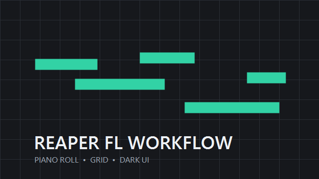

# REAPER FL Workflow

<p align="center">
  
</p>

<p align="center">
  <a href="https://github.com/SakiikaVR/REAPER-FL-Workflow/releases/latest">
    
  </a>
  <a href="LICENSE">
    
  </a>
</p>

REAPER 7の操作感と見た目を、FL Studio寄りにまとめて適用するWindows用セットアップです。ピアノロール、ホイール操作、トラック追加、Gridbox、ダークモード、起動ロゴを一度に設定します。REAPER標準のフォントとテーマは変更しません。

現在の仕様は **v1.1.0** です。

## 特長

- ピアノロールの空白を左ドラッグしてノートを作成・伸縮
- 直前に置いた、または選択したノートの長さを次の入力へ記憶
- 右クリック・右ドラッグでノートとCCをすぐ削除
- `Ctrl`＋ドラッグで矩形選択、`Shift`＋ドラッグでノート複製
- 通常画面とMIDIエディターのホイールを縦スクロールへ統一
- `Ctrl`＋ホイールで横方向をズーム
- 空きトラック欄の「＋」からソフトシンセトラックを直接追加
- Gridboxを右上へ配置し、REAPER起動時に自動実行
- ReaperDarkModeでWindows標準ダイアログを暗色化
- REAPER標準のフォントとテーマを変更しない
- オリジナル起動ロゴを適用
- インストール前の設定を自動バックアップし、ダブルクリックで復元

## インストール

動作対象は **Windows 10 / 11、REAPER 7.80 x64** です。

1. 作業中のプロジェクトを保存し、REAPERを終了します。
2. [最新リリース](https://github.com/SakiikaVR/REAPER-FL-Workflow/releases/latest)から `REAPER-FL-Workflow-v1.1.0.exe` をダウンロードします。
3. ダウンロードした `.exe` をダブルクリックします。
4. REAPERが起動したら完了です。

v1.0.0をインストール済みの場合は、先にその配布物の `Uninstall.cmd` で元の設定に戻してからv1.1.0を導入してください。以前のフォント拡張とテーマも復元されます。

管理者権限は不要です。ファイルは `%APPDATA%\REAPER` だけへ保存します。

## 操作

### ピアノロール

| 操作 | 動作 |
|---|---|
| 空白を左クリック | ノートを配置 |
| 空白を左ドラッグ | ノートを配置して長さを変更 |
| `Ctrl`＋左ドラッグ | 矩形選択 |
| ノートを左ドラッグ | 移動 |
| `Shift`＋ノートを左ドラッグ | 複製 |
| ノート端を左ドラッグ | 長さを変更 |
| 右クリック・右ドラッグ | ノート／CCを即時削除 |
| `Ctrl`＋右ドラッグ | ノート／CCを矩形選択 |

ノートを伸ばした後、または既存ノートを一度選択した後に空白をクリックすると、その長さで次のノートを置けます。

### ホイール

| 場所 | ホイール | `Ctrl`＋ホイール |
|---|---|---|
| 通常画面 | 縦スクロール | 横方向ズーム |
| MIDIエディター | 縦スクロール | 横方向ズーム |

### シンセトラック

左側の空きトラック欄にある「＋」をクリックすると、`ソフトシンセを新規トラックに挿入`が直接開きます。

## 元に戻す

1. 作業中のプロジェクトを保存し、REAPERを終了します。
2. `%APPDATA%\REAPER\ReaperFLWorkflow-Uninstall.cmd` をダブルクリックします。

`%APPDATA%\REAPER\ReaperFLWorkflow-Backups` に保存したインストール直前の状態へ復元します。

## REAPERを日本語化する

[ReaperJPN-Phroneris](https://github.com/Phroneris/ReaperJPN-Phroneris)にはライセンス表記がないため、このリポジトリには日本語化ファイルを同梱していません。公式配布元から各自で導入してください。

1. [ReaperJPN-Phronerisの最新Release](https://github.com/Phroneris/ReaperJPN-Phroneris/releases/latest)を開きます。
2. `JPN_Phroneris.zip` をダウンロードして展開します。
3. Windows用の `JPN_Phroneris.ReaperLangPack` をダブルクリックします。
4. REAPERの確認画面でインストールを許可し、REAPERを再起動します。

翻訳の更新状況やトラブルシューティングは[公式Wiki](https://github.com/Phroneris/ReaperJPN-Phroneris/wiki)を参照してください。

## 変更される場所

| 対象 | 内容 |
|---|---|
| `reaper-mouse.ini` / ExtState | FL風ピアノロール操作と元設定の記録 |
| `reaper-kb.ini` | 通常画面・MIDIエディターのホイール操作 |
| `reaper-menu.ini` | Empty TCP area toolbarの「＋」 |
| `REAPER.ini` | 起動ロゴ |
| `Scripts/FLPianoRoll` | 自作ReaScript |
| `Scripts/FTC/Adaptive grid` | Gridbox |
| `Scripts/__startup.lua` | Gridboxの自動起動 |
| `UserPlugins` | DarkMode、js_ReaScriptAPI |

## 開発と確認

インストーラーは別のリソースフォルダーを指定できるため、実環境を変更せずに検証できます。

```powershell
powershell -NoProfile -ExecutionPolicy Bypass -File .\Install.ps1 `
  -ResourcePath .\.test-resource -SkipLaunch
```

単一実行ファイルを作成する場合は、Windows標準のIExpressを使用します。

```powershell
.\Build-Release.ps1
```

## ファイル構成

```text
├─ Build-Release.ps1               # 単一EXEの作成
├─ RunInstaller.ps1                # EXE内の起動処理
├─ Install.cmd / Install.ps1       # 展開版インストーラー
├─ Uninstall.cmd / Uninstall.ps1   # バックアップから復元
├─ payload/
│  ├─ Data/                        # 起動ロゴ
│  ├─ Scripts/                     # FLピアノロールとGridbox
│  └─ UserPlugins/                 # x64拡張DLL
├─ third_party/                    # 外部ライセンス
├─ THIRD_PARTY_NOTICES.md
└─ LICENSE
```

## 外部コンポーネント

- [ReaperDarkMode v1.1.0](https://github.com/RobKor77/ReaperDarkMode) — MIT
- [Reaper-Tools / Gridbox](https://github.com/iliaspoulakis/Reaper-Tools) — MIT
- [js_ReaScriptAPI v1.310](https://github.com/juliansader/ReaExtensions) — MIT

詳しい著作権表示は[THIRD_PARTY_NOTICES.md](THIRD_PARTY_NOTICES.md)と[`third_party/`](third_party/)に収録しています。REAPER本体と標準テーマは配布物に含みません。

## ライセンス

[MIT License](LICENSE)

REAPERはCockos Incorporated、FL StudioはImage-Lineの製品です。各名称は互換性と操作方法の説明にのみ使用しています。本プロジェクトは両社の公式製品ではありません。
